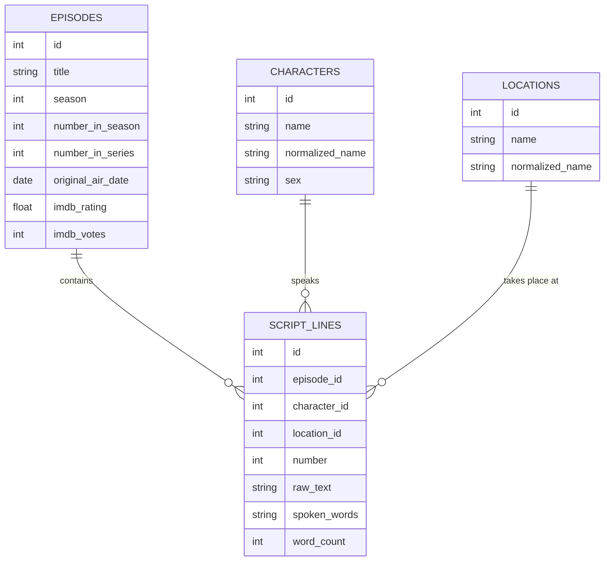

# Test Data project

As a data platform engineer, I often need to test code on non-production data. Not all datasets are available on all platforms. This repo provides a collection of datasets that can be used to test code on different platforms.
Each dataset is available in multiple formats and sizes to allow for testing on different platforms.

## 🎬 Simpsons Dataset

The Simpsons dataset is available across all platforms.

## 🛠️ Quick Start

| Service        | Command                                     | Documentation                                  |
| :------------- | :------------------------------------------ | :--------------------------------------------- |
| **DuckDB**     | `docker compose --profile duckdb up -d`     | [duckdb/README.md](./duckdb/README.md)         |
| **Garage**     | `docker compose --profile garage up -d`     | [garage/README.md](./garage/README.md)         |
| **PostgreSQL** | `docker compose --profile postgresql up -d` | [postgresql/README.md](./postgresql/README.md) |
| **Oracle**     | `docker compose --profile oracle up -d`     | [oracle/README.md](./oracle/README.md)         |

## 🔐 Environment Variables (`.env`)

Copy `.env.example` or create a `.env` file in the root directory with the following variables:

### S3 / Garage

| Variable        | Description                | Default   |
| :-------------- | :------------------------- | :-------- |
| `S3_ACCESS_KEY` | Access key for the S3 user | `GK35...` |
| `S3_SECRET_KEY` | Secret key for the S3 user | `7d37...` |

### PostgreSQL

| Variable            | Description            | Default          |
| :------------------ | :--------------------- | :--------------- |
| `POSTGRES_USER`     | Admin username         | `postgres`       |
| `POSTGRES_PASSWORD` | Admin password         | `new_password`   |
| `POSTGRES_DB`       | Default database name  | `postgres`       |
| `PGADMIN_MAIL`      | PGAdmin login email    | `your@email.com` |
| `PGADMIN_PW`        | PGAdmin login password | `changeit`       |

### Oracle

| Variable          | Description                               | Default      |
| :---------------- | :---------------------------------------- | :----------- |
| `ORACLE_PASSWORD` | Password for the `SYS` and `SYSTEM` users | `helloworld` |
