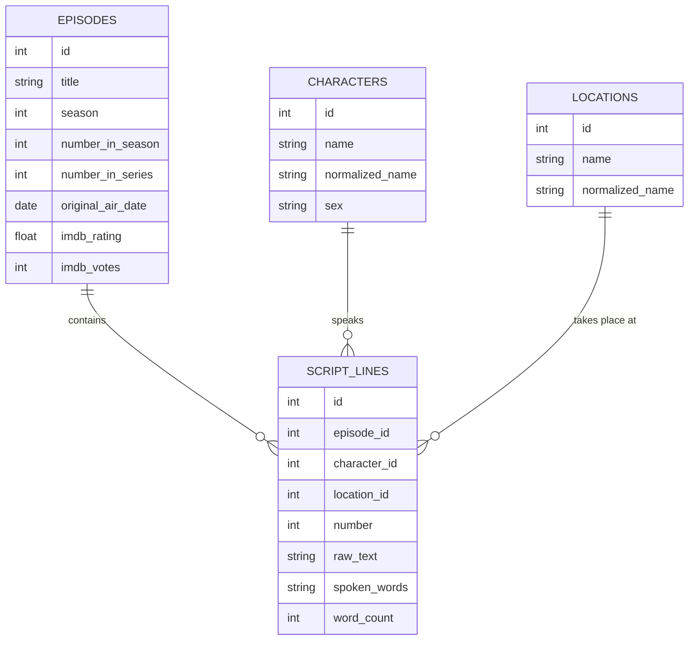

# Test data

As a data platform engineer, I often need to test code on non-production data. Not all datasets are available on all platforms. This repo provides a collection of datasets that can be used to test code on different platforms.
Each dataset is available in multiple formats and sizes to allow for testing on different platforms.

## Simpsons dataset

The same Simpsons dataset is available in multiple formats and sizes to allow for testing on different platforms.



## DuckDB

Start the DuckDB database:

```bash
docker compose --profile duckdb up -d
```

This will create a DuckDB instance, with 1 database and 1 table in that database you will find the house price from Garage S3 dataset.

### Variables

| Variable      | Description                |
| ------------- | -------------------------- |
| S3_ACCESS_KEY | Access key for the S3 user |
| S3_SECRET_KEY | Secret key for the S3 user |

## Garage

Start the Garage database:

```bash
docker compose --profile garage up -d
```

This will create a single node S3 instance, with 1 bucket and 1 file in that bucket.

### Variables

| Variable      | Description                |
| ------------- | -------------------------- |
| S3_ACCESS_KEY | Access key for the S3 user |
| S3_SECRET_KEY | Secret key for the S3 user |

## Postgresql

Start the Postgresql database:

```bash
docker compose --profile postgresql up -d
```

This will create a single node Postgresql instance, with 1 database and 1 table in that database you will find the [Pagila](https://github.com/devrimgunduz/pagila) dataset.

### Variables

| Variable      | Description            |
| ------------- | ---------------------- |
| POSTGRES_USER | Postgres user name     |
| POSTGRES_PW   | Postgres user password |
| POSTGRES_DB   | Database name          |
| PGADMIN_MAIL  | PGAdmin email          |
| PGADMIN_PW    | PGAdmin password       |

## Oracle

Start the Oracle Free database with the HR schema installed:

```bash
docker compose --profile oracle up -d
```

The source of the HR schema is located at https://github.com/oracle-samples/db-sample-schemas/tree/main/human_resources.

Connect to the database:

```bash
docker compose --profile oracle exec oracle sqlcl /nolog <<EOF
connect sys/\$ORACLE_PASSWORD@localhost:1521/pdb1 as sysdba
EOF
```

Host: localhost
Port: 1521
Service name: pdb1
Username: hr
Password: see your .env file

### Variables

| Variable        | Description               |
| --------------- | ------------------------- |
| ORACLE_PASSWORD | Password for the SYS user |
